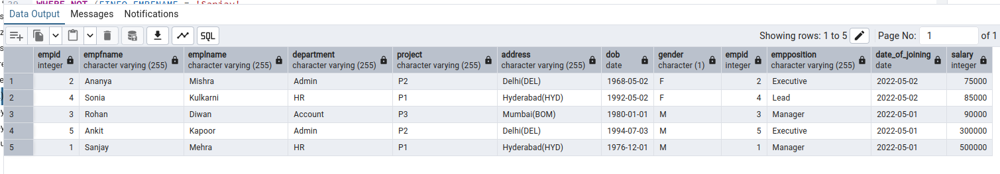

# SQL Task

### 1.Write a query to fetch the number of employees working in the department ‘Admin’
`SELECT COUNT(EMPID) AS "EMPLOYEE_IN_ADMIN" FROM EMPLOYEEINFO WHERE DEPARTMENT = 'Admin'` 

### 2.Write a query to retrieve the first four characters of  EmpLname from the EmployeeInfo table.
`SELECT SUBSTRING(EMPLNAME, 1, 4) AS "RESULT" FROM EMPLOYEEINFO`

### 3.Write q query to find all the employees whose salary is between 50000 to 100000.
`SELECT EINFO.EMPFNAME || ' ' || EINFO.EMPLNAME AS "EMPNAME" 
FROM EMPLOYEEINFO AS EINFO 
JOIN EMPLOYEEPOSITION AS EPOS 
ON EINFO.EMPID = EPOS.EMPID 
WHERE EPOS.SALARY BETWEEN 50000 AND 100000`

### 4.Write a query to find the names of employees that begin with ‘S’
`SELECT EMPFNAME AS "RESULT"
FROM EMPLOYEEINFO
WHERE EMPFNAME LIKE 'S%'`

### 5.Write a query to fetch top N records order by salary. (ex. top 5 records)
`SELECT * 
FROM EMPLOYEEINFO AS EINFO 
JOIN EMPLOYEEPOSITION AS EPOS 
ON EINFO.EMPID = EPOS.EMPID 
ORDER BY EPOS.SALARY
LIMIT 5`

### 6.Write a query to fetch details of all employees excluding the employees with first names, “Sanjay” and “Sonia” from the EmployeeInfo table.
`SELECT * 
FROM EMPLOYEEINFO AS EINFO 
JOIN EMPLOYEEPOSITION AS EPOS 
ON EINFO.EMPID = EPOS.EMPID 
WHERE NOT (EINFO.EMPFNAME = 'Sanjay'
OR EINFO.EMPFNAME = 'Sonia')`

### 7.Write a query to fetch the department-wise count of employees sorted by department’s count in ascending order.
`SELECT COUNT(EMPID) AS "COUNT OF EMP", DEPARTMENT FROM EMPLOYEEINFO
GROUP BY DEPARTMENT
ORDER BY COUNT(EMPID)`

### 8.Create indexing for any particular field and show the difference in data fetching before and after indexing
`SELECT * FROM EMPLOYEEINFO WHERE PROJECT = 'P3'`
BEFORE APPLYING INDEXING:

`CREATE INDEX IND
ON
EMPLOYEEINFO(PROJECT)
SELECT * FROM EMPLOYEEINFO WHERE PROJECT = 'P3'`
